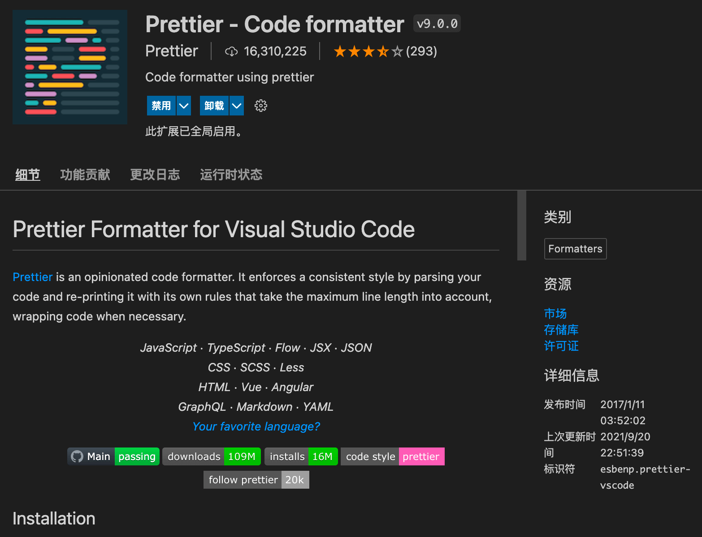
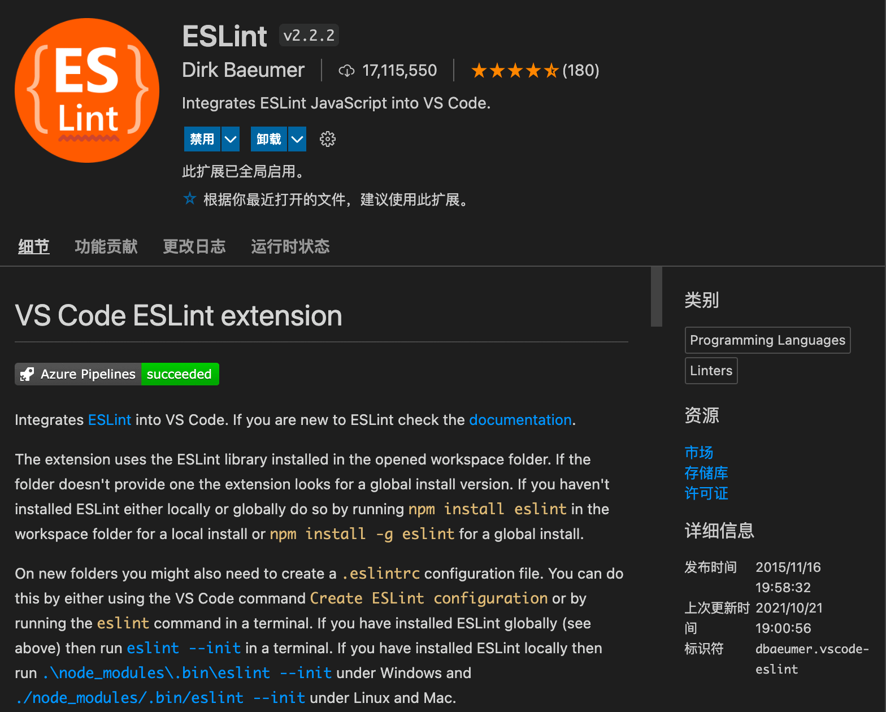

校验插件包含：Eslint、Prettier。
<!-- more -->

## VScode 安装插件

<a href="https://prettier.io/">

</a>
<a href="https://eslint.org/">

</a>


## 项目安装依赖

```bash
npm/cnpm install eslint prettier --save-dev
# 或者
yarn add eslint prettier --dev
```


## 格式校验配置

在项目根目录新建 `.eslintrc.js` 文件或者 `.eslintrc.json`，用作配置格式校验规则（建议使用js文件，方便写注释）。具体配置如下：

```javascript
module.exports = {
  root: true,
  env: {
    browser: true,
    node: true,
  },
  parserOptions: {
    ecmaVersion: 2020,
  },
  extends: [
    "plugin:vue/vue3-essential", // vue3
    "plugin:vue/essential", // vue2
    "eslint:recommended",
    "@vue/typescript/recommended",
    "@vue/prettier",
    "@vue/prettier/@typescript-eslint",
  ],
  plugins: ["prettier"],
  rules: {
    /*  "vue/html-self-closing": [
      "error",
      {
        html: {
          void: "never",
          normal: "never",
          component: "always",
        },
        svg: "always",
        math: "always",
      },
    ], */
    // @fixable 禁止使用 debugger
    "no-debugger": "warn",

    // 禁止在函数参数中出现重复名称的参数
    "no-dupe-args": "warn",

    // 禁止在对象字面量中出现重复名称的键名
    "no-dupe-keys": "error",

    // 禁止在 switch 语句中出现重复测试表达式的 case
    "no-duplicate-case": "error",

    // 禁止出现空代码块，允许 catch 为空代码块
    "no-empty": [
      "error",
      {
        allowEmptyCatch: true,
      },
    ],

    // 必须使用 isNaN(foo) 而不是 foo === NaN
    "use-isnan": "error",

    // switch 语句必须有 default
    "default-case": "error",

    // 禁止使用 alert
    "no-alert": "warn",

    // switch 的 case 内有变量定义的时候，必须使用大括号将 case 内变成一个代码块
    "no-case-declarations": "error",

    // switch 的 case 内必须有 break, return 或 throw
    "no-fallthrough": "error",

    // 禁止在 setTimeout 或 setInterval 中传入字符串，如 setTimeout('alert("Hi!")', 100);
    "no-implied-eval": "error",

    // 禁止重复定义变量
    "no-redeclare": "error",

    // 禁止将自己赋值给自己
    "no-self-assign": "error",

    // 禁止将自己与自己比较
    "no-self-compare": "error",

    // 循环内必须对循环条件的变量有修改
    "no-unmodified-loop-condition": "error",

    // 禁止无用的表达式
    "no-unused-expressions": [
      "error",
      {
        allowShortCircuit: true,
        allowTernary: true,
        allowTaggedTemplates: true,
      },
    ],

    // 禁止使用保留字作为变量名
    "no-shadow-restricted-names": "error",

    // 禁止使用未定义的变量
    "no-undef": [
      "error",
      {
        typeof: false,
      },
    ],

    /*  // 定义过的变量必须使用
    "no-unused-vars": [
      "error",
      {
        vars: "all",
        args: "none",
        caughtErrors: "none",
        ignoreRestSiblings: true,
      },
    ], */
    // 定义过的变量必须使用
    "@typescript-eslint/no-unused-vars": [
      "error",
      {
        vars: "all",
        args: "none",
        caughtErrors: "none",
        ignoreRestSiblings: true,
      },
    ],

    // 变量必须先定义后使用
    "no-use-before-define": [
      "error",
      {
        functions: false,
        classes: false,
        variables: false,
      },
    ],

    // @fixable 逗号前禁止有空格，
    "comma-spacing": [
      "error",
      {
        before: false, // 逗号前禁止有空格
        // 'after': false
      },
    ],

    // @fixable 禁止在行首写逗号
    "comma-style": ["error", "last"],
    // @fixable 一个缩进必须用四个空格替代
    // @off 先不限制
    indent: [
      "off",
      4,
      {
        SwitchCase: 1,
        flatTernaryExpressions: true,
      },
    ],

    // 双引号
    quotes: [2, "double"],

    // @fixable 对象字面量中冒号前面禁止有空格，后面必须有空格
    "key-spacing": [
      "error",
      {
        beforeColon: false,
        afterColon: true,
        mode: "strict",
      },
    ],

    // 代码块嵌套的深度禁止超过 5 层
    "max-depth": ["error", 5],

    // 限制一个文件最多的行数
    // 1000行
    "max-lines": ["warn", 1000],

    // new 后面的类名必须首字母大写
    "new-cap": [
      "error",
      {
        newIsCap: true,
        capIsNew: false,
        properties: true,
      },
    ],

    // @fixable 结尾必须有分号
    semi: [
      "error",
      "always",
      {
        omitLastInOneLineBlock: true,
      },
    ],

    // 禁止对使用 const 定义的常量重新赋值
    "no-const-assign": "error",

    // @fixable 禁止解构时出现同样名字的的重命名，比如 let { foo: foo } = bar;
    "no-useless-rename": "error",

    // @fixable ... 的后面禁止有空格
    "rest-spread-spacing": ["error", "never"],

    //对象字面量中的属性名是否强制双引号
    // 0忽略   1 警告     2报错
    "quote-props": [0, "always"],
    semi: [2, "always"], //语句强制分号结尾

    // 禁止出现没必要的转义
    // 放开转义字符的限制
    "no-useless-escape": "off",
    "@typescript-eslint/ban-types": "off",
    "@typescript-eslint/no-explicit-any": ["off"],
    "@typescript-eslint/explicit-module-boundary-types": "off",
    "@typescript-eslint/no-var-requires": "off",
  },
};
```

当然也可以在 `package.json` 文件中进行配置，但是那样会导致该文件篇幅过长。
